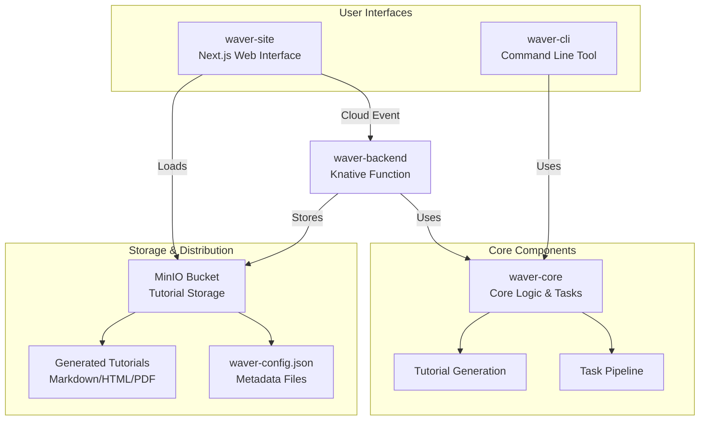

<!-- For a centered logo -->
<p align="center">
  
</p>
<h2 align="center">
  <b> Waver - An AI-Powered Code Tutorial Generator </b>
</h2>

Waver is a comprehensive platform that generates interactive code tutorials from source code using Large Language Models (LLMs). It analyzes source code to identify abstractions and relationships, then generates structured tutorials with chapters that can be consumed through multiple interfaces.

## Architecture Overview

Waver is distributed across four main components, each serving a specific purpose in the tutorial generation and consumption pipeline:



## Component Overview

### 🧠 [waver-core](waver-core/README.md)
The heart of the Waver platform containing:
- **Task Pipeline Framework**: `Task`, `TaskPipeline`, and `PipelineContext` classes
- **Tutorial Generation Engine**: Core logic for analyzing code and generating structured tutorials
- **Code Analysis**: Abstractions identification, relationship analysis, and chapter organization
- **LLM Integration**: Support for multiple providers (OpenAI, Gemini) via LangChain4j

### 🖥️ [waver-cli](waver-cli/README.md)
Command-line interface that leverages waver-core:
- **Local Processing**: Generate tutorials from local directories or Git repositories
- **Multiple Output Formats**: Markdown, HTML, and PDF generation
- **Native Builds**: GraalVM native-image compilation for optimal performance
- **Uber JAR**: Self-contained executable with all dependencies

### ⚡ [waver-backend](waver-backend/README.md)
Serverless function built with Quarkus:
- **Cloud Event Processing**: Receives tutorial generation requests from waver-site
- **Git Repository Processing**: Clones and analyzes remote repositories
- **MinIO Integration**: Stores generated tutorials and metadata in S3-compatible storage
- **waver-config.json**: Produces metadata files for each tutorial

### 🌐 [waver-site](waver-site/README.md)
Modern web interface built with Next.js:
- **Tutorial Request Interface**: Submit Git URLs for tutorial generation
- **Cloud Event Dispatch**: Sends requests to waver-backend via Knative
- **Tutorial Display**: Renders generated tutorials with interactive features
- **MinIO Integration**: Loads and displays tutorials from storage bucket

## Key Features

- **Intelligent Code Analysis**: Identifies abstractions, relationships, and architectural patterns
- **Multi-Format Output**: Generate tutorials in Markdown, HTML, or PDF formats
- **Cloud-Native Architecture**: Serverless backend with event-driven processing
- **Multiple Access Patterns**: CLI for developers, web interface for end users
- **S3-Compatible Storage**: Scalable storage with MinIO integration
- **LLM Provider Flexibility**: Support for OpenAI, Gemini, and extensible architecture

## Quick Start

### Prerequisites
- Java 21 or higher
- Maven 3.8 or higher
- Node.js 18+ (for waver-site)
- MinIO or S3-compatible storage
- LLM API keys (OpenAI, Gemini)

### Building the Entire Project
```bash
# Build all Java components
mvn clean install

# Build the web interface
cd waver-site
npm install
npm run build
```

### Running Individual Components

#### CLI Tool
```bash
# From waver-cli directory
mvn clean package -pl waver-cli
java -jar target/waver-cli-1.0-SNAPSHOT.jar --help
```

#### Backend Function
```bash
# From waver-backend directory
mvn clean package -pl waver-backend
java -jar target/quarkus-app/quarkus-run.jar
```

#### Web Interface
```bash
# From waver-site directory
npm run dev
# Open http://localhost:3000
```

## Development

- **Core Development**: [waver-core/README.md](waver-core/README.md)
- **CLI Development**: [waver-cli/README.md](waver-cli/README.md)
- **Backend Development**: [waver-backend/README.md](waver-backend/README.md)
- **Web Development**: [waver-site/README.md](waver-site/README.md)

## Documentation

- [Developers Guide](docs/DEVELOPERS.md): Detailed information for developers working on Waver
- [Contributors Guide](docs/CONTRIBUTORS.md): Guidelines for contributing to the project
- [Maven Build Guide](docs/README-MAVEN.md): Comprehensive build and deployment instructions
