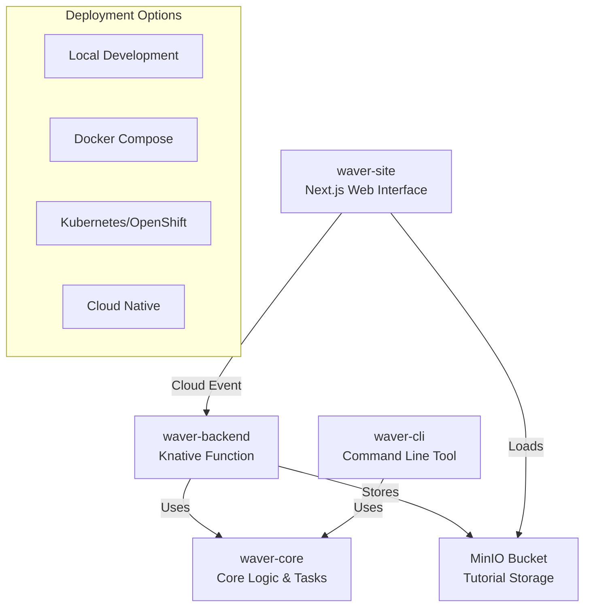

# Waver Deployment Guide

Complete guide for deploying the distributed Waver architecture across all components.

## 🏗️ Architecture Overview

Waver is distributed across four main components that work together to provide a complete tutorial generation platform:



## 📋 Prerequisites

### System Requirements
- **Java 21+**: For all Java components
- **Node.js 18+**: For waver-site
- **Maven 3.8+**: For Java builds
- **Docker**: For containerized deployment
- **MinIO/S3**: Storage backend

### API Keys
- **OpenAI API Key**: For OpenAI LLM provider
- **Gemini API Key**: For Google Gemini LLM provider

### Network Access
- **GitHub/GitLab**: For repository access
- **LLM APIs**: OpenAI and Gemini endpoints
- **Storage**: MinIO or S3-compatible storage

## 🚀 Deployment Options

### Option 1: Local Development (Recommended for Development)

#### 1.1 Build All Components
```bash
# Clone the repository
git clone https://github.com/yourusername/waver.git
cd waver

# Build all Java components
mvn clean install

# Build waver-site
cd waver-site
npm install
npm run build
cd ..
```

#### 1.2 Start MinIO Storage
```bash
# Start MinIO using Docker Compose
cd waver-backend/deploy
docker-compose up -d minio

# Access MinIO console at http://localhost:9001
# Default credentials: minioadmin/minioadmin
```

#### 1.3 Start Backend Service
```bash
# Start waver-backend in development mode
cd waver-backend
mvn quarkus:dev

# The service will be available at http://localhost:8080
```

#### 1.4 Start Web Interface
```bash
# Start waver-site in development mode
cd waver-site
npm run dev

# The web interface will be available at http://localhost:3000
```

#### 1.5 Test CLI Tool
```bash
# Test the CLI tool
cd waver-cli
java -jar target/waver-cli-1.0-SNAPSHOT.jar --help
```

### Option 2: Docker Compose (Recommended for Testing)

#### 2.1 Create Docker Compose File
Create a `docker-compose.yml` file in the root directory:

```yaml
version: '3.8'

services:
  minio:
    image: minio/minio:latest
    ports:
      - "9000:9000"
      - "9001:9001"
    environment:
      MINIO_ROOT_USER: minioadmin
      MINIO_ROOT_PASSWORD: minioadmin
      MINIO_BUCKETS: waver-bucket
    volumes:
      - minio_data:/data
      - minio_config:/root/.minio
    command: server /data --console-address ":9001"
    healthcheck:
      test: ["CMD", "curl", "-f", "http://localhost:9000/minio/health/live"]
      interval: 30s
      timeout: 20s
      retries: 3

  waver-backend:
    build:
      context: ./waver-backend
      dockerfile: Dockerfile
    ports:
      - "8080:8080"
    environment:
      - MINIO_ENDPOINT=http://minio:9000
      - MINIO_ACCESS_KEY=minioadmin
      - MINIO_SECRET_KEY=minioadmin
      - MINIO_BUCKET=waver-bucket
      - OPENAI_API_KEY=${OPENAI_API_KEY}
      - GEMINI_AI_KEY=${GEMINI_AI_KEY}
    depends_on:
      minio:
        condition: service_healthy
    healthcheck:
      test: ["CMD", "curl", "-f", "http://localhost:8080/q/health"]
      interval: 30s
      timeout: 10s
      retries: 3

  waver-site:
    build:
      context: ./waver-site
      dockerfile: Dockerfile
    ports:
      - "3000:3000"
    environment:
      - NEXT_PUBLIC_BACKEND_URL=http://waver-backend:8080
      - NEXT_PUBLIC_MINIO_ENDPOINT=http://minio:9000
      - NEXT_PUBLIC_MINIO_BUCKET=waver-bucket
    depends_on:
      waver-backend:
        condition: service_healthy

volumes:
  minio_data:
  minio_config:
```

#### 2.2 Deploy with Docker Compose
```bash
# Set environment variables
export OPENAI_API_KEY="your-openai-api-key"
export GEMINI_AI_KEY="your-gemini-api-key"

# Start all services
docker-compose up -d

# Check service status
docker-compose ps

# View logs
docker-compose logs -f
```

#### 2.3 Access Services
- **MinIO Console**: http://localhost:9001 (minioadmin/minioadmin)
- **Waver Backend**: http://localhost:8080
- **Waver Site**: http://localhost:3000

### Option 3: Kubernetes/OpenShift (Production)

#### 3.1 Prerequisites
- Kubernetes cluster (1.24+) or OpenShift cluster (4.10+)
- `kubectl` or `oc` CLI tools
- Container registry access (Quay.io, Docker Hub, etc.)

#### 3.2 Build and Push Images
```bash
# Set registry variables
export REGISTRY="quay.io/yournamespace"
export IMAGE_TAG="latest"

# Build and push waver-backend
cd waver-backend
docker build -t ${REGISTRY}/waver-backend:${IMAGE_TAG} .
docker push ${REGISTRY}/waver-backend:${IMAGE_TAG}

# Build and push waver-site
cd ../waver-site
docker build -t ${REGISTRY}/waver-site:${IMAGE_TAG} .
docker push ${REGISTRY}/waver-site:${IMAGE_TAG}
```

#### 3.3 Deploy to Kubernetes
```bash
# Create namespace
kubectl create namespace waver

# Apply MinIO deployment
kubectl apply -f k8s/minio/

# Apply waver-backend deployment
kubectl apply -f k8s/waver-backend/

# Apply waver-site deployment
kubectl apply -f k8s/waver-site/

# Check deployment status
kubectl get all -n waver
```

#### 3.4 OpenShift Specific
```bash
# Login to OpenShift
oc login --token=<your-token> --server=<your-cluster-url>

# Create project
oc new-project waver

# Deploy using OpenShift templates
oc apply -f openshift/
```

### Option 4: Cloud Native (Serverless)

#### 4.1 Knative Deployment
```bash
# Install Knative Serving
kubectl apply -f https://github.com/knative/serving/releases/download/knative-v1.9.0/serving-core.yaml

# Deploy waver-backend as Knative service
kn service create waver-backend \
  --image ${REGISTRY}/waver-backend:${IMAGE_TAG} \
  --env MINIO_ENDPOINT=http://minio:9000 \
  --env OPENAI_API_KEY=${OPENAI_API_KEY}
```

#### 4.2 Cloud Functions
- **AWS Lambda**: Deploy waver-backend as Lambda function
- **Google Cloud Functions**: Deploy using Cloud Functions framework
- **Azure Functions**: Deploy using Azure Functions runtime

## 🔧 Configuration

### Environment Variables

#### Waver Backend
```bash
# LLM Configuration
OPENAI_API_KEY=your-openai-api-key
GEMINI_AI_KEY=your-gemini-api-key
WAVER_LLM_PROVIDER=Gemini
WAVER_OUTPUT_FORMAT=MARKDOWN

# MinIO Configuration
MINIO_ENDPOINT=http://minio:9000
MINIO_ACCESS_KEY=minioadmin
MINIO_SECRET_KEY=minioadmin
MINIO_BUCKET=waver-bucket

# Application Configuration
QUARKUS_HTTP_PORT=8080
QUARKUS_LOG_LEVEL=INFO
```

#### Waver Site
```bash
# Backend Configuration
NEXT_PUBLIC_BACKEND_URL=http://localhost:8080
NEXT_PUBLIC_CLOUD_EVENT_ENDPOINT=http://localhost:8080

# MinIO Configuration
NEXT_PUBLIC_MINIO_ENDPOINT=http://localhost:9000
NEXT_PUBLIC_MINIO_BUCKET=waver-bucket
NEXT_PUBLIC_MINIO_REGION=us-east-1

# GitHub Integration
GITHUB_TOKEN=your-github-token
```

### Configuration Files

#### Application Properties (waver-backend)
```properties
# src/main/resources/application.properties
waver.llm.provider=Gemini
waver.output.format=MARKDOWN

quarkus.minio.endpoint=http://localhost:9000
quarkus.minio.access-key=minioadmin
quarkus.minio.secret-key=minioadmin
quarkus.minio.bucket=waver-bucket

quarkus.http.port=8080
quarkus.log.level=INFO
```

#### Next.js Configuration (waver-site)
```typescript
// next.config.ts
const nextConfig = {
  output: 'standalone',
  experimental: {
    outputFileTracingRoot: path.join(__dirname, '../../'),
  },
  env: {
    BACKEND_URL: process.env.NEXT_PUBLIC_BACKEND_URL,
    MINIO_ENDPOINT: process.env.NEXT_PUBLIC_MINIO_ENDPOINT,
  },
}
```

## 📊 Monitoring and Observability

### Health Checks
```bash
# Check waver-backend health
curl http://localhost:8080/q/health

# Check waver-site health
curl http://localhost:3000/api/health

# Check MinIO health
curl http://localhost:9000/minio/health/live
```

### Logs
```bash
# Docker Compose logs
docker-compose logs -f waver-backend
docker-compose logs -f waver-site

# Kubernetes logs
kubectl logs -f deployment/waver-backend -n waver
kubectl logs -f deployment/waver-site -n waver
```

### Metrics
```bash
# Prometheus metrics
curl http://localhost:8080/q/metrics

# Application metrics
curl http://localhost:8080/q/health/ready
```

## 🔄 CI/CD Pipeline

### GitHub Actions Example
```yaml
name: Deploy Waver Platform
on:
  push:
    branches: [main]

jobs:
  build-and-test:
    runs-on: ubuntu-latest
    steps:
    - uses: actions/checkout@v3
    
    - name: Set up Java
      uses: actions/setup-java@v3
      with:
        java-version: '21'
        distribution: 'temurin'
    
    - name: Build Java components
      run: mvn clean install
    
    - name: Set up Node.js
      uses: actions/setup-node@v3
      with:
        node-version: '18'
    
    - name: Build waver-site
      run: |
        cd waver-site
        npm ci
        npm run build
    
    - name: Run tests
      run: |
        mvn test
        cd waver-site && npm test

  deploy:
    needs: build-and-test
    runs-on: ubuntu-latest
    steps:
    - uses: actions/checkout@v3
    
    - name: Deploy to Kubernetes
      run: |
        # Deploy to your cluster
        kubectl apply -f k8s/
```

## 🧹 Cleanup and Maintenance

### Docker Compose Cleanup
```bash
# Stop all services
docker-compose down

# Remove volumes
docker-compose down -v

# Remove images
docker-compose down --rmi all
```

### Kubernetes Cleanup
```bash
# Remove all resources
kubectl delete namespace waver

# Remove specific deployments
kubectl delete -f k8s/
```

### Data Backup
```bash
# Backup MinIO data
docker exec minio mc mirror /data /backup

# Backup configuration
tar -czf waver-config-backup.tar.gz config/
```

## 🐛 Troubleshooting

### Common Issues

#### Backend Service Not Starting
```bash
# Check Java version
java -version

# Check Maven version
mvn -version

# Check environment variables
env | grep -E "(OPENAI|GEMINI|MINIO)"

# Check logs
mvn quarkus:dev -pl waver-backend
```

#### MinIO Connection Issues
```bash
# Check MinIO service
docker ps | grep minio

# Test MinIO connectivity
curl http://localhost:9000/minio/health/live

# Check MinIO logs
docker logs minio
```

#### Web Interface Issues
```bash
# Check Node.js version
node --version

# Check npm version
npm --version

# Clear Next.js cache
rm -rf waver-site/.next
rm -rf waver-site/node_modules
npm install
```

### Performance Tuning

#### JVM Tuning (waver-backend)
```bash
# Increase heap size
export JAVA_OPTS="-Xmx4g -Xms2g"

# Enable native compilation
mvn clean package -Pnative
```

#### Node.js Tuning (waver-site)
```bash
# Increase memory limit
export NODE_OPTIONS="--max-old-space-size=4096"

# Enable production optimizations
npm run build
npm start
```

## 📚 Additional Resources

- [Waver Core Documentation](../waver-core/README.md)
- [Waver CLI Documentation](../waver-cli/README.md)
- [Waver Backend Documentation](../waver-backend/README.md)
- [Waver Site Documentation](../waver-site/README.md)
- [Quarkus Documentation](https://quarkus.io/guides/)
- [Next.js Documentation](https://nextjs.org/docs)
- [MinIO Documentation](https://docs.min.io/)
- [Kubernetes Documentation](https://kubernetes.io/docs/)
- [OpenShift Documentation](https://docs.openshift.com/)
