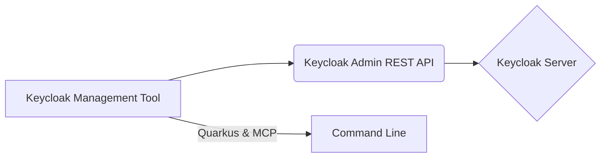

# Introduction to Keycloak Management on OpenShift

This tutorial will guide you through building a robust Keycloak management tool deployed on Red Hat OpenShift. This tool simplifies Keycloak administration by providing a streamlined command-line interface for managing realms, users, groups, roles, identity providers, and authentication flows. Whether you're a seasoned developer or new to Keycloak, this tutorial will equip you with the knowledge and skills to efficiently manage your Keycloak instances.

## Core Concepts

Our Keycloak management tool interacts with the Keycloak server via the Keycloak Admin REST API. It leverages the Quarkus framework with the MCP (Managed Container Platform) extension to expose functionalities as command-line tools.  These tools allow for easy scripting and automation of Keycloak administrative tasks.  We'll cover the management of the following Keycloak resources:

* **Realm Management:** Creating, updating, and deleting realms.
* **User Management:** Managing users within a realm, including creation, deletion, updating, and role assignments.
* **Group Management:** Organizing users into groups, managing group memberships, and assigning roles to groups.
* **Role Management:** Defining roles and permissions, and assigning them to users and groups.
* **Identity Provider Management:** Integrating with external identity providers for user authentication.
* **Authentication Flow Management:** Customizing authentication processes for different use cases.
* **Client Management:** Managing client applications registered with Keycloak.

## Technical Stack

* **Quarkus:** A Kubernetes-native Java framework tailored for GraalVM and HotSpot, known for its fast startup time and low memory footprint, perfect for containerized environments.
* **Keycloak Admin REST API:**  The interface used by our tool to interact with Keycloak and perform management operations.
* **MCP (Managed Container Platform) Extension:**  Simplifies the creation of command-line tools within Quarkus.
* **Jackson:** For JSON serialization and deserialization, enabling easy data exchange with the Keycloak API.
* **Keycloak Admin Client:** A Java library for interacting with the Keycloak Admin REST API.

## OpenShift Deployment

Red Hat OpenShift is a key component of this project. It provides a containerized platform optimized for deploying and managing applications like our Keycloak management tool. OpenShift's benefits include:

* **Simplified Deployment:** Streamlined deployment process for containerized applications.
* **Scalability:** Easily scale the management tool based on demand.
* **Resilience:** OpenShift ensures high availability and fault tolerance.
* **Management:** Centralized management and monitoring of deployed applications.
* **Integration:** Seamlessly integrates with other OpenShift services.

This introduction provides a foundational understanding of the Keycloak management tool we'll be building. The following chapters will delve into each aspect in detail, providing step-by-step instructions and practical examples. Let's get started!
## Chapters

* [Realm Management](./1-Realm-Management.md)
* [Client Management](./2-Client-Management.md)
* [Role Management](./3-Role-Management.md)
* [User Management](./4-User-Management.md)
* [Group Management](./5-Group-Management.md)
* [Identity Provider Management](./6-Identity-Provider-Management.md)
* [Authentication Flow Management](./7-Authentication-Flow-Management.md)
* [OpenShift Deployment](./8-OpenShift-Deployment.md)
* [Discourse Search Integration](./9-Discourse-Search-Integration.md)
